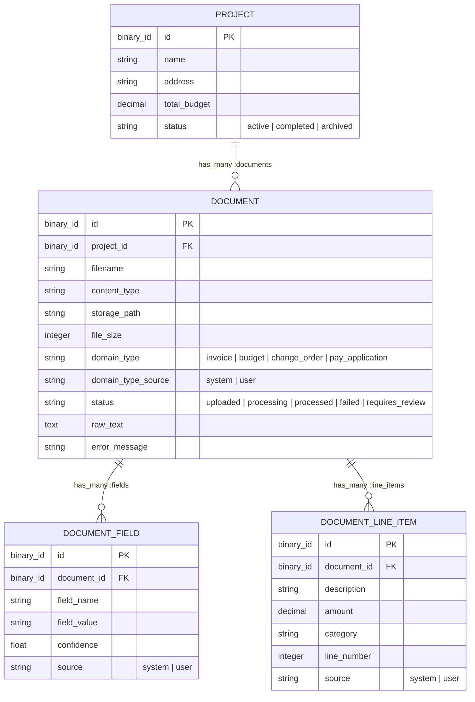

# DocPipeline

[](LICENSE)

DocPipeline is a Phoenix application for managing construction loan
projects and the documents (invoices, budgets, change orders, pay
applications) submitted against them. Uploaded documents are classified
and have structured fields/line items extracted from them via an AI
pipeline (Claude by default), processed asynchronously with Oban. The
API is exposed over GraphQL (Absinthe).

## Prerequisites

* Elixir `~> 1.15` and a compatible Erlang/OTP
* PostgreSQL running locally (defaults to `localhost`, see
  `config/dev.exs` / `config/test.exs`)
* Node is not required — assets are built with `esbuild`/`tailwind`,
  which `mix setup` installs automatically

## Setup

```bash
# Install dependencies, create/migrate the dev database, and build assets
mix setup
```

### Environment variables

For real (non-mock) AI classification/extraction, set an Anthropic API
key before starting the server:

```bash
export ANTHROPIC_API_KEY=sk-ant-...
```

The test environment does not call the real API — it uses
`DocPipeline.AI.Classifier.MockAdapter` / `DocPipeline.AI.Extractor.MockAdapter`
(configured in `config/test.exs`) instead.

Production additionally requires `DATABASE_URL`, `SECRET_KEY_BASE`, and
`PHX_HOST` — see `config/runtime.exs` for the full list and defaults.

## Running the server

```bash
iex -S mix phx.server
```

Then visit:

* [`localhost:4000`](http://localhost:4000) — the app
* [`localhost:4000/graphiql`](http://localhost:4000/graphiql) — GraphQL
  playground for exploring/testing the API (`/graphql` is the API
  endpoint itself)

If the server fails to start with `:eaddrinuse`, port 4000 is already
held by another process (commonly a previous `phx.server` run that
didn't shut down cleanly) — find and stop it with `lsof -nP -iTCP:4000 -sTCP:LISTEN`.

## Running tests

```bash
mix test
```

The `test` alias creates/migrates the test database automatically
before running (`config/test.exs` uses the `doc_pipeline_test` database,
partitioned per `MIX_TEST_PARTITION` for parallel test runs).

## Before committing

```bash
mix precommit
```

Runs `compile --warnings-as-errors`, `deps.unlock --unused`, `format`,
and `test` — fix any issues this surfaces before opening a PR.

## Architecture overview

* **`DocPipeline.Projects`** / **`DocPipeline.Documents`** — the core
  contexts. Projects own documents; documents own extracted fields and
  line items.
* **`DocPipeline.AI.Classifier`** / **`DocPipeline.AI.Extractor`** —
  behaviours with pluggable adapters (a real Claude-backed adapter and
  a mock adapter for tests), configured via `:doc_pipeline, :classifier_adapter`
  / `:extractor_adapter`.
* **`DocPipeline.Workers.ProcessDocumentWorker`** — an Oban worker that
  runs an uploaded document through text extraction, classification,
  and field/line-item extraction, updating its status throughout.
* **`DocPipelineWeb.Schema`** — the Absinthe GraphQL schema, combining
  query/mutation fields from `Schema.ProjectTypes` and `Schema.DocumentTypes`,
  served at `/graphql`.

## Data model



**Walkthrough:**

1. A **Project** is created (e.g. `"123 Main Street"`) and owns any number
   of **Documents** uploaded against it (`Project.has_many :documents` /
   `Document.belongs_to :project`, FK `document.project_id`, `on_delete: :delete_all`
   so deleting a project cascades to its documents).
2. Uploading a document (`Documents.upload_document/4`) writes the file to
   `priv/uploads`, inserts a `Document` row with `status: "uploaded"`, and
   enqueues `ProcessDocumentWorker` via Oban.
3. The worker walks the document through `status` values in order —
   `uploaded → processing → processed` on success, or `failed` /
   `requires_review` if a step errors or the classifier returns an
   unrecognized type — while extracting `raw_text` and setting `domain_type`.
4. Once classified, the extractor produces the document's **DocumentFields**
   (key/value pairs like `vendor_name`, `invoice_number`) and
   **DocumentLineItems** (e.g. individual invoice/budget line entries),
   each `belongs_to :document` with `on_delete: :delete_all`.
5. Both `DocumentField` and `DocumentLineItem` carry a `source` column
   (`"system"` vs `"user"`): AI-extracted values start as `"system"`
   with a `confidence` score, and flip to `"user"` (confidence `1.0` for
   fields) when corrected via `update_field/2` or `correct_document_type/2`
   — the latter also deletes and re-triggers extraction for the corrected
   type.
